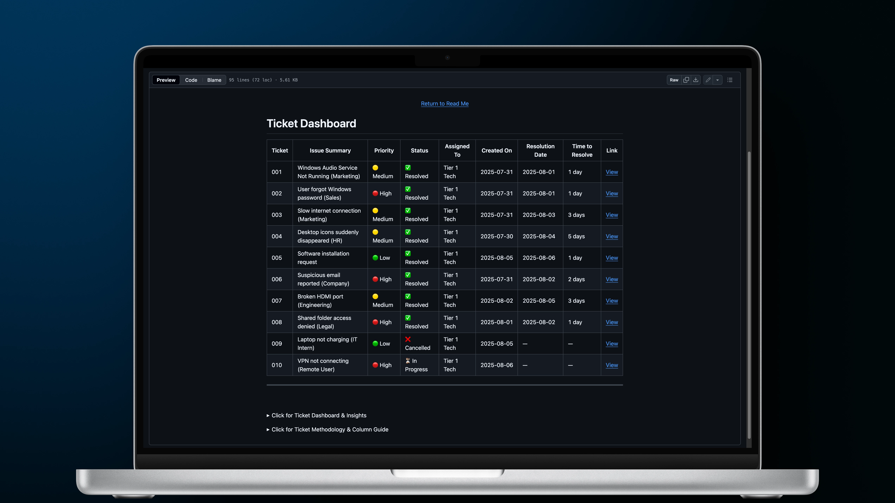

# IT Help Desk Simulation

A professional simulation of real-world IT support tickets, created as part of my **CompTIA A+ certification projects**.  
This project showcases my troubleshooting skills, clear documentation, and ability to follow industry-standard workflows for IT support.

 

  

 

---

## Project Overview

The **IT Help Desk Simulation** is designed to replicate day-to-day help desk operations.  
It includes:

- Realistic IT issues
- Step-by-step troubleshooting
- Screenshot documentation
- Professional ticket formatting

This project reflects **real-world IT support best practices** and is intended for **portfolio demonstration only**.

---

## Dashboard

View the complete ticket list and progress:  
 [Dashboard](dashboard.md)

---

## Features

- **Authentic ticket workflow** — from issue reporting to resolution.
- **Detailed documentation** — clear, step-by-step guides with annotated screenshots.
- **A+ Certification alignment** — skills directly mapped to CompTIA A+ exam objectives.
- **Professional formatting** — clean, consistent, and easy to follow.

---

## License

This project is licensed under the **Creative Commons Attribution-NonCommercial-NoDerivatives 4.0 International License**.

You are free to:

- **Share** — copy and redistribute the material in any medium or format.

Under the following terms:

- **Attribution** — You must give appropriate credit, provide a link to the license, and indicate if changes were made.
- **NonCommercial** — You may not use the material for commercial purposes.
- **NoDerivatives** — You may not remix, transform, or build upon the material.

Full License: [LICENSE](LICENSE)

---

 
 

Click for more details About Me, This Project & The Knowledge Applied

## About Me, This Project & The Knowledge Applied

This project is part of my **CompTIA A+ Certification portfolio** — designed to demonstrate real-world IT support expertise and professional documentation skills.

By applying knowledge from multiple **CompTIA A+ domains**, I successfully created and executed this **IT Helpdesk Simulation**, diagnosing and resolving realistic technical issues in a structured and methodical way.  
This project drew on competencies across these technical areas:

---

<strong>1. Hardware</strong>

- **Peripheral Installation & Configuration:** Setup and troubleshooting of printers, webcams, and display adapters in both physical and virtualized environments.
- **Video Output Troubleshooting:** Diagnosing HDMI and USB-C to HDMI adapter issues, identifying driver limitations, and resolving virtual machine display compatibility problems.
- **Printer Hardware Setup:** Configuring correct device ports (Standard TCP/IP, LPT, COM, USB Virtual ports) and adjusting hardware parameters.
- **Printer Maintenance & Troubleshooting:** Managing print queues, clearing stuck jobs, handling spooler service failures, and resolving “offline” printer statuses.
- **Virtualization Hardware Configuration:** Allocating CPU, RAM, and enabling virtual machine display/USB passthrough settings.

---

<strong>2. Networking</strong>

- **Network Adapter Configuration:** Setting IPv4/IPv6 parameters, enabling/disabling interfaces, and verifying adapter properties.
- **Network Troubleshooting Commands:** Using `ipconfig`, `ping`, and loopback tests to diagnose connectivity problems.
- **Physical Media Knowledge:** Understanding Ethernet cabling, USB network adapters, and connector standards.
- **Wireless Configuration:** Validating SSID connections, network profiles, and wireless driver health.
- **Network Printing:** Adding printers via TCP/IP and ensuring correct port configurations.

---

<strong>3. Operating Systems (Windows)</strong>

- **User Account Troubleshooting:** Resetting credentials, reactivating disabled accounts, and checking permission settings.
- **Device Manager Proficiency:** Installing, updating, rolling back, and uninstalling drivers for audio, video, and network devices.
- **Software Installation & Management:** Installing LibreOffice and other applications, verifying installation integrity, and configuring defaults.
- **Display Configuration:** Adjusting resolution, scaling, refresh rates, and multiple monitor modes (extend/duplicate).
- **Audio Troubleshooting:** Restoring missing output devices, updating audio drivers, and verifying related services.
- **Service Management:** Starting/stopping services and configuring startup settings (e.g., Print Spooler).

---

<strong>4. Security</strong>

- **Email Threat Analysis:** Identifying phishing attempts via mismatched sender domains, suspicious URLs, and deceptive display names.
- **Safe Download Practices:** Obtaining software from verified sources, ensuring authenticity, and validating file integrity.
- **Security Awareness Simulation:** Recognizing and mitigating social engineering tactics in simulated environments.

---

<strong>5. Software Troubleshooting</strong>

- **Application Launch Failures:** Resolving executable issues, compatibility conflicts, and missing dependencies.
- **Print Job Failures:** Clearing queues, restarting spooler services, and reinstalling printer drivers.
- **Driver Conflict Resolution:** Addressing post-update device malfunctions and restoring prior drivers.
- **Default Application Settings:** Assigning default programs for specific file types.

---

<strong>6. Operational Procedures</strong>

- **Ticket Documentation:** Creating consistent, professional records of issues, steps taken, and resolutions.
- **Structured Troubleshooting:** Applying the CompTIA A+ 7-step methodology to resolve technical problems efficiently.
- **Knowledge Base Development:** Documenting repeat issues and solutions for quick future reference.
- **Time Management:** Prioritizing workload based on ticket urgency and business impact.
- **Change Simulation:** Using VM snapshots to test and roll back solutions safely.
- **Professional Communication:** Presenting technical information in clear, client-friendly language.

---

 
 
 
 

Click for Contact Links

**Connect with me:**

- [GitHub](https://github.com/MustafaHabibX)

 
 

 
  <a href="/dashboard.md">Dashboard</a> /
  <a href="/dashboard.md">License</a> 

